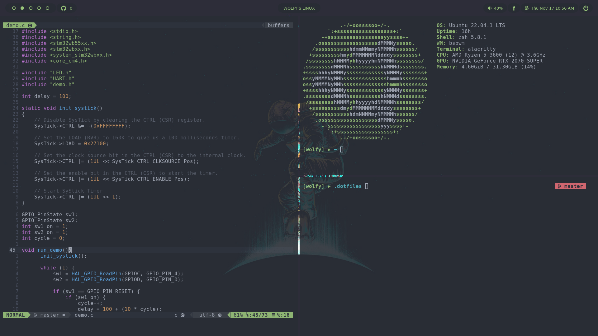

<h1 align="center">🏠 wolfy's dotfiles 🏠</h1>

### CLI

- [ZSH](https://zsh.sourceforge.io/) - A shell designed for interactive use
- [Hyper Terminal](https://hyper.is/) - A terminal built on web technologies
  - [hyperborder](https://github.com/webmatze/hyperborder) - Adds a gradient border to the Hyper terminal
  - [hyper-opacity](https://github.com/lucleray/hyper-opacity) - Set the opacity of your Hyper terminal
  - [hyper-tab-icons](https://github.com/dfrankland/hyper-tab-icons) - Icons in the header tabs for the current running process in Hyper.app
  - [hyper-search](https://github.com/jaanauati/hyper-search) - Search-text plugin for Hyper.js
  - [hyper-cwd](https://github.com/hharnisc/hypercwd) - Opens new tabs with the same directory as the current tab in Hyper
  - [hyperminimal](https://github.com/jancborchardt/hyperminimal) - Hyper terminal extension to remove window header
  - [hyper-snazzy](https://github.com/sindresorhus/hyper-snazzy) - Elegant Hyper theme with bright colors

### Plugins

- [vim-airline](https://github.com/vim-airline/vim-airline) - Lean & mean status/tabline for vim that's light as air
  - [vim-airline-themes](https://github.com/vim-airline/vim-airline-themes) - A collection of themes for vim-airline
- [dashboard-vim](https://github.com/glepnir/dashboard-nvim) - Vim Dashboard
- [markdown-preview](https://github.com/iamcco/markdown-preview.nvim) - Markdown preview plugin for (neo)vim
- [nvim-cmp](https://github.com/hrsh7th/nvim-cmp) - A completion plugin for neovim coded in Lua.
  - [cmp-nvim-lsp](https://github.com/hrsh7th/cmp-nvim-lsp) - Nvim-cmp source for neovim builtin LSP client
  - [cmp-buffer](https://github.com/hrsh7th/cmp-buffer) - Nvim-cmp source for buffer words
  - [cmp-path](https://github.com/hrsh7th/cmp-path) - Nvim-cmp source for path
  - [LuaSnip](https://github.com/L3MON4D3/LuaSnip) - Snippet Engine for Neovim written in Lua.
  - [cmp_luasnip](https://github.com/saadparwaiz1/cmp_luasnip) - Luasnip completion source for nvim-cmp
  - [lspkind-nvim](https://github.com/onsails/lspkind.nvim) - Vscode-like pictograms for neovim lsp completion items
- [nvim-lspconfig](https://github.com/neovim/nvim-lspconfig) - Quickstart configs for Nvim LSP
- [nvim-tree](https://github.com/kyazdani42/nvim-tree.lua) - A file explorer tree for neovim written in lua
  - [nvim-web-devicons](https://github.com/kyazdani42/nvim-web-devicons) - Lua `fork` of vim-web-devicons for neovim
- [telescope](https://github.com/nvim-telescope/telescope.nvim) - Find, Filter, Preview, Pick. All lua, all the time.
- [vim-commentary](https://github.com/tpope/vim-commentary) - Comment stuff out
- [vim-devicons](https://github.com/ryanoasis/vim-devicons) - Adds file type icons to Vim plugins such as: NERDTree, vim-airline, CtrlP, unite, Denite, lightline, vim-startify and many more
- [vim-floaterm](https://github.com/voldikss/vim-floaterm) - Terminal manager for (neo)vim
- [vim-fugitive](https://github.com/tpope/vim-fugitive) - A Git wrapper so awesome, it should be illegal
- [vim-heritage](https://github.com/jessarcher/vim-heritage) - Automatically create missing parent directories when saving a new file
- [vim-lastplace](https://github.com/farmergreg/vim-lastplace) - Intelligently reopen files at your last edit position in Vim.
- [vim-one](https://github.com/rakr/vim-one) - Adaptation of one-light and one-dark colorschemes for Vim
- [vim-polyglot](https://github.com/sheerun/vim-polyglot) - A solid language pack for Vim
- [vim-ripgrep](https://github.com/jremmen/vim-ripgrep) - Use RipGrep in Vim and display results in a quickfix list
- [vim-visual-multi](https://github.com/mg979/vim-visual-multi) - Multiple cursors plugin for vim/neovim
- [which-key](https://github.com/folke/which-key.nvim) - Create key bindings that stick. WhichKey is a lua plugin for Neovim 0.5 that displays a popup with possible keybindings of the command you started typing

### Notes

If you intend you use these dotfiles please take a look at the `.zshrc` file and accompanying sources (`.variables`, `.functions`, `.aliases`) and make changes so that it fits your needs. Currently, the `.zshrc` config will use a function to check for configs and match them with this repo to keep them all up-to-date.
